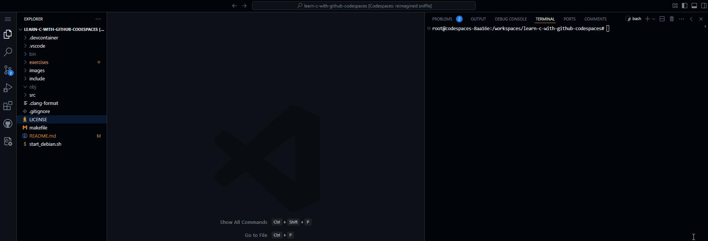

# Working with GitHub Codespaces

Fork the repository and launch codespaces to run!

This set of exercises will help you understand the compiler errors etc in a set of exercises.

1. Use the terminal to run `make` to complie `clings`.

2. Run `clings`

3. Follow the instructions inside each exercise as directred by the terminal output.

    

